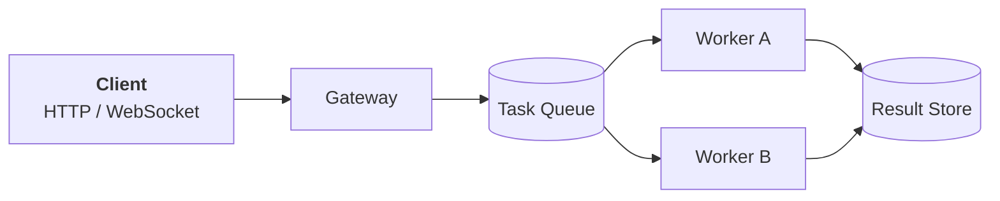

# 🚀 Project **Nebula**

> A fictional distributed task engine demonstrating complex, GitHub-compatible Markdown.

[](#)
[](#)
[](#)

## 📋 Implementation Status

- [x] Define the event protocol
- [x] Implement retry policies
- [ ] Add distributed tracing
  - [x] Generate trace IDs
  - [ ] Export OpenTelemetry spans
- [ ] Perform production load testing

## Architecture



### Component Matrix

| Component | Language | State | Throughput |
|:--|:--:|--:|--:|
| Gateway | Rust | ✅ Stable | 42k req/s |
| Scheduler | Go | 🧪 Beta | 18k jobs/s |
| Dashboard | TypeScript | 🚧 Active | N/A |

## Example Configuration

```yaml
server:
  address: "0.0.0.0:8080"
  workers: 8

retry:
  strategy: exponential
  maximum_attempts: 5
  initial_delay: 250ms
```

## API Usage

```rust
use nebula::{Client, Task};

async fn dispatch(client: &Client) -> anyhow::Result<()> {
    let task = Task::new("generate-report")
        .argument("format", "pdf")
        .priority(10);

    let receipt = client.submit(task).await?;
    println!("Task submitted: {}", receipt.id());

    Ok(())
}
```

> [!IMPORTANT]
> Task handlers **must be idempotent** because workers may retry interrupted jobs.

> [!WARNING]
> Setting `maximum_attempts` to `0` disables the retry limit and may create a poison-message loop.

<details>
<summary><strong>View the retry algorithm</strong></summary>

For attempt \(n\), the delay is conceptually:

```text
delay(n) = min(initial_delay × 2ⁿ + jitter, maximum_delay)
```

| Attempt | Base Delay | Example with Jitter |
|--:|--:|--:|
| 1 | 250 ms | 284 ms |
| 2 | 500 ms | 571 ms |
| 3 | 1 s | 1.08 s |
| 4 | 2 s | 2.17 s |

</details>

## Sample Event

```json
{
  "event": "task.completed",
  "version": 2,
  "data": {
    "task_id": "task_01JABCDEF",
    "duration_ms": 1842,
    "result": {
      "status": "success",
      "artifacts": ["report.pdf"]
    }
  }
}
```

---

### Notes

1. Events are ordered **per task**, not globally.
2. Delivery is *at least once*.
3. Clients should preserve unknown fields for forward compatibility.[^compat]

[^compat]: This enables older clients to safely proxy events created by newer protocol versions.

**Next step:** review [`docs/protocol.md`](./docs/protocol.md) and open a pull request referencing an issue—for example, `Closes #42`.
