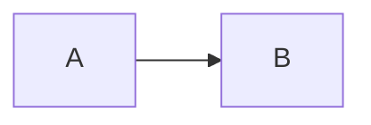

# Semantic coverage

> [!IMPORTANT]
> Alert body with [link](./docs/protocol.md "Protocol") and .

For $x^2$ and:

$$x = y + 1$$

Reference.[^note]

[^note]: Footnote **body**.

| Left | Center | Right |
|:--|:--:|--:|
| a | b | c |

More
Body

